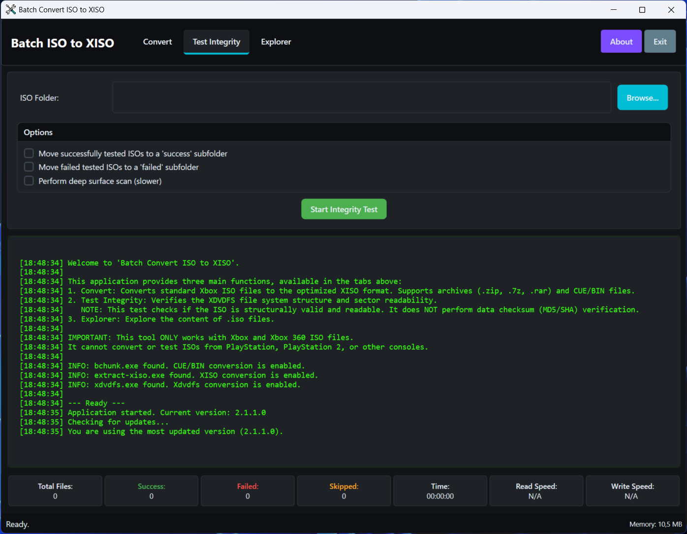
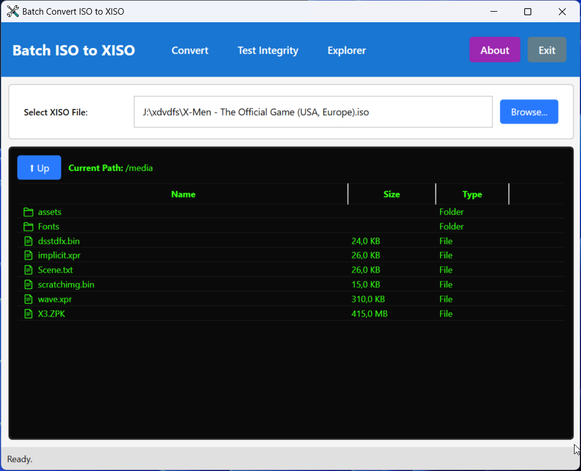

# Batch ISO to XISO Converter

**Batch ISO to XISO** is a high-performance Windows WPF utility designed for the Xbox preservation and emulation community. It provides a streamlined way to convert standard Xbox and Xbox 360 ISOs into the optimized, trimmed **XISO** format, verify their structural integrity, and explore their contents.

Built with a **native C# XDVDFS engine**, this tool eliminates the need for legacy external command-line tools for core ISO operations, offering superior speed and modern features like real-time disk write monitoring.

The application follows modern software architecture principles with **Dependency Injection (DI)** and a **service-oriented design**, ensuring maintainability, testability, and clean separation of concerns.

---

## 🚀 Key Features

### 1. Batch Conversion
*   **Smart Trimming**: Rebuilds ISOs into the XISO format, removing gigabytes of unnecessary system padding.
*   **Archive Support**: Directly process `.zip`, `.7z`, and `.rar` files. The tool extracts, converts, and cleans up automatically.
*   **CUE/BIN Support**: Integrated `bchunk` support to convert old-school disc images to ISO before processing.
*   **System Update Removal**: Option to skip the `$SystemUpdate` folder to save additional space.

### 2. Integrity Testing
*   **Structural Validation**: Traverses the XDVDFS file tree to ensure the filesystem is valid and readable.
*   **Deep Surface Scan**: Optional sequential sector reading to detect physical data corruption or "bad sectors" in the image.
*   **Batch Organization**: Automatically move "Passed" or "Failed" images into dedicated subfolders.

### 3. XISO Explorer
*   **Native Browsing**: Open any Xbox ISO to browse files and directories without extracting them.
*   **Metadata View**: View file sizes, attributes, and directory structures directly within the UI.

### 4. Advanced Monitoring
*   **Real-time Stats**: Track success/fail counts, elapsed time, and processed file lists.
*   **Disk Monitor**: Live monitoring of write speeds and drive activity to identify hardware bottlenecks.

---

## 🏗️ Architecture

The application is built with a **modern, modular architecture** using:

### Dependency Injection (DI)
- Services are registered and resolved through a central DI container (`Microsoft.Extensions.DependencyInjection`)
- Promotes loose coupling and enables easy unit testing
- Proper service lifecycle management (singletons, transients)

### Service-Oriented Design
The codebase is organized into well-defined interfaces and implementations:

| Interface | Service | Purpose |
| :--- | :--- | :--- |
| `ILogger` | `LoggerService` | Centralized logging to the UI |
| `IBugReportService` | `BugReportService` | Automatic error reporting |
| `IDiskMonitorService` | `DiskMonitorService` | Real-time disk write speed monitoring |
| `IFileExtractor` | `FileExtractorService` | Archive extraction (.zip, .7z, .rar) |
| `IFileMover` | `FileMoverService` | Safe file moving with retry logic |
| `IMessageBoxService` | `MessageBoxService` | Abstracted UI dialogs for testability |
| `INativeIsoIntegrityService` | `NativeIsoIntegrityService` | XDVDFS filesystem validation |
| `IOrchestratorService` | `OrchestratorService` | Coordinates batch operations |
| `IExternalToolService` | `ExternalToolService` | External tool execution (bchunk) |
| `IUpdateChecker` | `UpdateChecker` | GitHub release checking |
| `IUrlOpener` | `UrlOpenerService` | Cross-platform URL handling |

### Key Benefits
- **Testability**: Interfaces enable mocking for unit tests
- **Maintainability**: Clear separation of concerns between UI and business logic
- **Extensibility**: New features can be added by implementing existing interfaces
- **Reliability**: Proper disposal patterns and exception handling throughout

---

## 📂 Supported Formats

| Task | Supported Input Formats |
| :--- | :--- |
| **Conversion** | `.iso`, `.zip`, `.7z`, `.rar`, `.cue` / `.bin` |
| **Testing** | `.iso` (Direct files) |
| **Explorer** | `.iso` (Xbox/Xbox 360 XDVDFS) |

---

## 🛠️ Requirements

*   **Operating System**: Windows 10 (version 1809) or later / Windows 11.
*   **Runtime**: [.NET 10.0 Desktop Runtime](https://dotnet.microsoft.com/download/dotnet/10.0).
*   **Architecture**: x64 (64-bit) is required for archive extraction features.

---

## 📖 How to Use

### Conversion
1.  Select your **Source Folder** (contains your ISOs or archives).
2.  Select an **Output Folder** (where the trimmed XISOs will be saved).
3.  *(Optional)* Enable **Delete original files** if you wish to replace your library with XISOs (use with caution!).
4.  Click **Start Conversion**.

### Integrity Testing
1.  Switch to the **Test Integrity** tab.
2.  Select the folder containing your ISOs.
3.  Choose whether to perform a **Deep Surface Scan** (thorough but slower).
4.  Click **Start Integrity Test**.

### Explorer
1.  Switch to the **Explorer** tab.
2.  Browse for a specific `.iso` file.
3.  Double-click folders to navigate the internal Xbox filesystem.

---

## 🛡️ Safety & Reliability

*   **Temp Folder Protection**: To prevent data loss, the app restricts users from selecting system temporary directories as source or destination folders.
*   **Cloud-Aware**: Detects if files are stored in the cloud (e.g., OneDrive) and prompts for hydration/download instead of crashing.
*   **Atomic Operations**: Converted files are verified before the original is deleted (if that option is enabled).
*   **Robust Error Handling**: Comprehensive exception handling with automatic bug reporting and graceful degradation.

---

## 📜 Acknowledgements

*   **bchunk**: Used for CUE/BIN to ISO conversion.
*   **SevenZipSharp**: Used for high-performance archive extraction.
*   **Pure Logic Code**: Developed and maintained by [Pure Logic Code](https://www.purelogiccode.com).

---

⭐ **If you find this tool useful, please give us a Star on GitHub!** ⭐