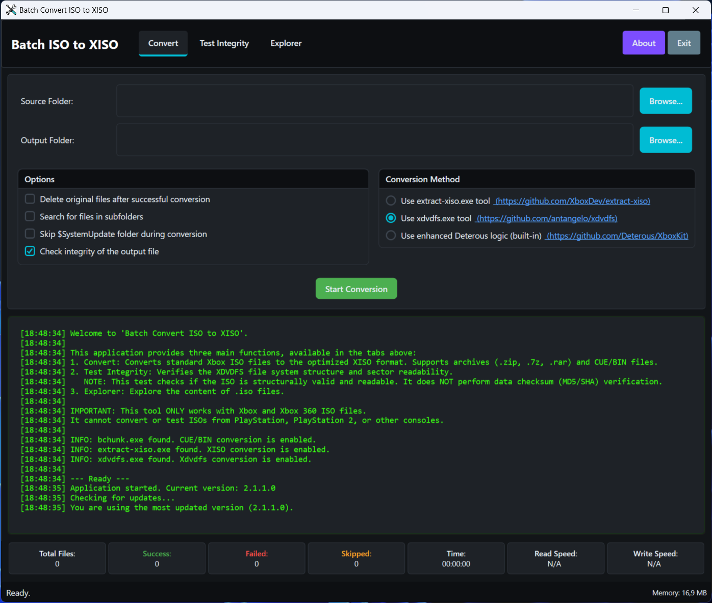
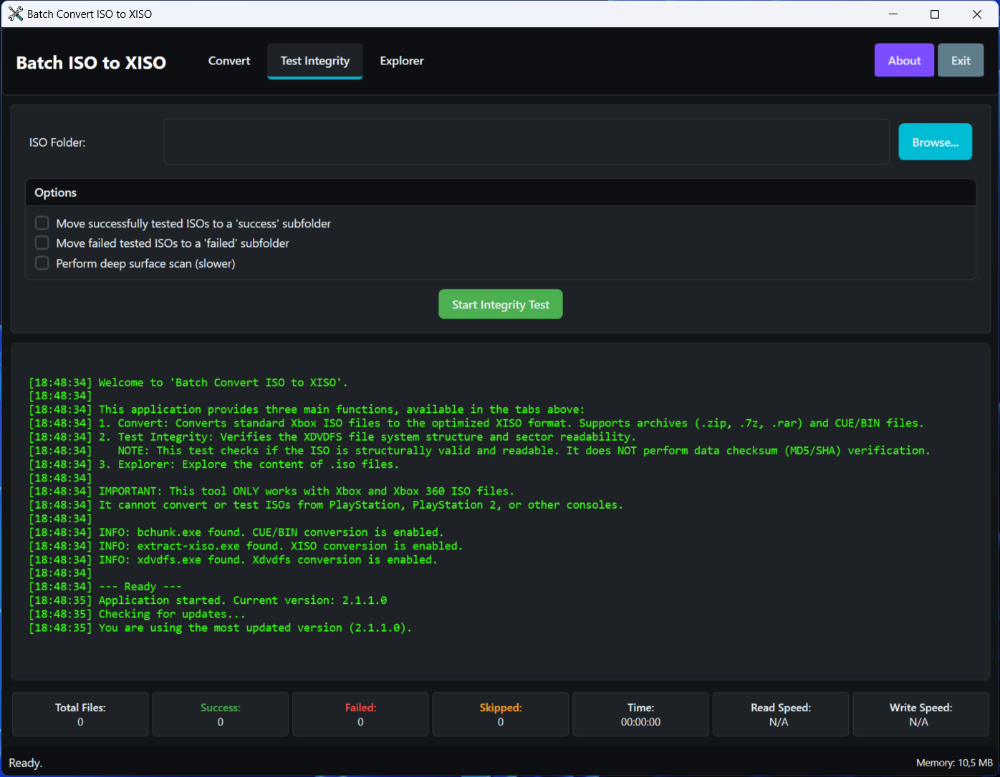
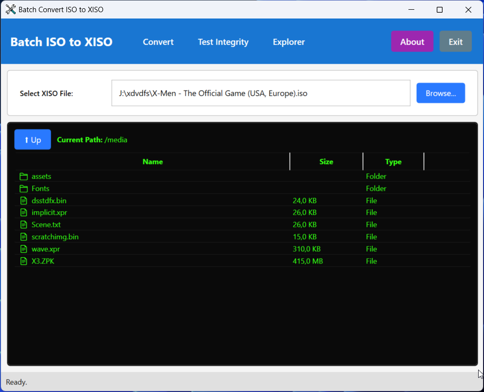

# Batch ISO to XISO Converter

[](https://www.microsoft.com/windows)
[](https://dotnet.microsoft.com/download/dotnet/10.0)
[](https://github.com/drpetersonfernandes/BatchConvertIsoToXiso/releases)
[](LICENSE.txt)
[](https://github.com/drpetersonfernandes/BatchConvertIsoToXiso/releases)

A high-performance Windows WPF utility for the Xbox preservation and emulation community. Convert, verify, and explore Xbox and Xbox 360 ISO files with dual-engine support: a native C# XDVDFS engine and external tool integration.

---

## 📋 Table of Contents

- [Overview](#overview)
- [Key Features](#key-features)
- [Installation](#installation)
- [Usage](#usage)
- [Supported Formats](#supported-formats)
- [Architecture](#architecture)
- [System Requirements](#system-requirements)
- [Safety & Reliability](#safety--reliability)
- [Screenshots](#screenshots)
- [Acknowledgements](#acknowledgements)
- [License](#license)

---

## Overview

**Batch ISO to XISO Converter** streamlines the process of converting standard Xbox and Xbox 360 ISOs into the optimized, trimmed **XISO** format. Built with a flexible multi-engine architecture, the tool combines a **native C# XDVDFS engine** with robust **external tool integration** (extract-xiso and xdvdfs), delivering superior performance and modern features like real-time disk write monitoring.

Whether you're managing a large collection of Xbox game backups or verifying the integrity of your dumps, this application provides a user-friendly interface with powerful batch processing capabilities.

---

## Key Features

### 🔄 Batch Conversion
- **Multi-Engine Support**: Choose between three conversion methods:
  - **extract-xiso** (external): Maximum compression by repacking
  - **xdvdfs** (external): Maximum compression with modern Rust implementation
  - **Modified Deterous Logic** (built-in): Fast trimming while preserving original structure
- **Smart Processing**: Removes video partitions and padding, converting Redump ISOs to playable XISO format
- **Archive Support**: Process `.zip`, `.7z`, and `.rar` files directly with high-performance extraction via SharpCompress
- **CUE/BIN Support**: Integrated `bchunk` support for converting classic disc images to ISO format
- **System Update Removal**: Option to skip the `$SystemUpdate` folder for additional space savings (supported by native engine and extract-xiso)

### ✅ Integrity Testing
- **Structural Validation**: Deep traversal of the XDVDFS file tree to ensure filesystem validity
- **Deep Surface Scan**: Optional sequential sector reading to detect physical data corruption or bad sectors
- **Batch Organization**: Automatically organize "Passed" or "Failed" images into dedicated subfolders

### 🔍 XISO Explorer
- **Native Browsing**: Open any Xbox ISO to browse files and directories without extraction
- **Metadata View**: View file sizes, attributes, and directory structures directly in the UI
- **Double-Click to Open**: Open files directly from the ISO with their default associated applications
- **Drag & Drop Extraction**: Drag files out of the explorer to extract them to any folder (Windows Explorer, Desktop, etc.)

### 📊 Advanced Monitoring
- **Real-time Statistics**: Track success/fail counts, elapsed time, and processed files
- **Disk Monitor**: Live monitoring of write speeds and drive activity to identify hardware bottlenecks
- **Cloud-Aware**: Automatic detection and handling of cloud-stored files (e.g., OneDrive)

---

## Installation

### Prerequisites
- **Operating System**: Windows 10 (version 1809) or later / Windows 11
- **Runtime**: [.NET 10.0 Desktop Runtime](https://dotnet.microsoft.com/download/dotnet/10.0)
- **Architecture Support**:
    - **x64 (64-bit)**: All three trim logics are supported.
    - **ARM64**: The built-in modified "Deterous Logic" is supported; the other two logics may also work.

### Steps
1. Download the latest release from the [Releases](https://github.com/drpetersonfernandes/BatchConvertIsoToXiso/releases) page
2. Extract the ZIP file to your desired location
3. Run `BatchConvertIsoToXiso.exe`

No installation required – the application is fully portable.

---

## Usage

### Converting ISOs
1. Launch the application
2. Click **"Select Input Folder"** and choose the directory containing your ISO files
3. Click **"Select Output Folder"** to specify where converted files will be saved
4. Configure options:
    - **Remove System Update**: Skip `$SystemUpdate` folder to save space
    - **Replace Originals**: Replace input files with converted versions
    - **Test After Conversion**: Automatically verify converted ISOs
    - **Conversion Method**: Select between:
          - **extract-xiso**: Smallest output, external tool
          - **xdvdfs**: Smallest output, external tool
          - **Modified Deterous Logic**: Built-in (enhanced from Deterous/XboxKit), preserves original layout
          > 💡 See [Conversion Methods Explained](#conversion-methods-explained) for detailed comparison
5. Click **"Convert"** to start the batch process

### Testing ISO Integrity
1. Switch to the **"Test ISO"** tab
2. Select your input folder containing ISO files
3. Enable **"Move Passed Files"** and/or **"Move Failed Files"** to organize results
4. Click **"Test ISOs"** to begin validation

### Exploring XISO Contents
1. Switch to the **"XISO Explorer"** tab
2. Click **"Open ISO"** and select an Xbox ISO file
3. Browse the file tree to view contents without extraction
4. **Open Files**: Double-click any file to open it with its default application
5. **Extract Files**: Drag and drop files from the explorer to Windows Explorer, Desktop, or any folder to extract them

---

## Conversion Methods Explained

The application offers **three conversion methods**, each using a different approach to convert Redump ISOs to XISO format:

### Method Comparison

| Feature | extract-xiso | xdvdfs | Modified Deterous Logic (Built-in) |
|:--------|:-------------|:-------|:----------------------------------|
| **Approach** | Repack | Repack | Trim |
| **Output Size** | Smallest | Smallest | Slightly Larger |
| **Safety** | High | High | **Highest** |
| **Preserves Layout** | No | No | **Yes** |
| **External Tool** | Required | Required | **Built-in** |

### What Gets Removed

All three methods remove these parts from Redump ISOs:
- ✅ **Video Partition** (DVD movie/demonstration) - **~7-387 MB removed**
- ✅ **End Padding** (empty sectors after last file) - **Variable**
- ✅ **System Update** (optional) - **~100-300 MB removed**

### Key Differences

#### extract-xiso (External Tool)
- **Developed by**: XboxDev team
- **Approach**: Reads the entire ISO, creates a new optimized XISO with files packed tightly together
- **Pros**: Smallest output size, well-tested
- **Cons**: Requires external executable
- **Best for**: Maximum storage savings

#### xdvdfs (External Tool)
- **Developed by**: antangelo
- **Approach**: Modern Rust implementation that rebuilds the XISO from scratch
- **Pros**: Smallest output size
- **Cons**: Requires external executable
- **Best for**: Maximum compatibility and storage savings

#### Modified Deterous Logic (Built-in)
- **Original Source**: Based on [XboxKit by Deterous](https://github.com/Deterous/XboxKit) `XDVDFS.cs` implementation for traversing XDVDFS filesystem
- **Approach**: **Trims** the ISO by identifying and copying only valid sectors (header, directory tree, file data) while preserving original file layout and gaps between files
- **Key Modifications & Enhancements** (compared to original):
  - Converted recursive directory traversal to **iterative stack-based** approach to avoid stack overflow on deep/complex directories
  - Added **cycle detection** using `HashSet` to prevent infinite loops
  - **Enhanced signature detection**: Supports multiple known XGD1/XGD2/XGD3 partition offsets + robust validation + fallback sector scanning for non-standard/Redump variants
  - **Optional $SystemUpdate skipping**: Can exclude system update files for extra space savings
  - Improved directory entry parsing, name reading, attribute handling, and comprehensive error handling/validation
  - Modern C# implementation with better performance and integration into the application
- **Pros**:
  - **Fastest** - No repacking, just selective sector copying
  - **Safest** - Preserves exact original XDVDFS structure and layout
  - **No external dependencies** - Pure C# implementation
- **Cons**: Output larger (preserves gaps between files from original ISO)
- **Best for**: Preserving original structure, debugging, maximum safety/compatibility

### Visual Comparison

```
Redump ISO (Original):
[Video Partition][XDVDFS: Header][Dir][File A][gap][File B][gap][File C][Padding]

extract-xiso / xdvdfs Output:
[XDVDFS: Header][Dir][File A][File B][File C] (gaps removed, tightly packed)
                      ↑    ↑    ↑
                 Files repositioned for maximum compression

Modified Deterous Logic Output:
[XDVDFS: Header][Dir][File A][gap][File B][gap][File C]
                       ↑         ↑
                  Original layout preserved, only video/padding removed
```

### Which Should You Choose?

| Use Case | Recommended Method |
|:---------|:-------------------|
| **Maximum storage savings** | xdvdfs or extract-xiso |
| **Preserving exact game structure** | Modified Deterous Logic |
| **Debugging / Development** | Modified Deterous Logic |
| **FTP transfer to Xbox** | xdvdfs or extract-xiso |

### Recommendation

**For most users**: If storage space is critical, use **xdvdfs** or **extract-xiso** for maximum compression. Use **Modified Deterous Logic** when you want to preserve the original file layout and structure from the source ISO.

---

## Supported Formats

| Operation      | Supported Formats                              |
|:---------------|:-----------------------------------------------|
| **Conversion** | `.iso`, `.zip`, `.7z`, `.rar`, `.cue` / `.bin` |
| **Testing**    | `.iso` (Direct files)                          |
| **Explorer**   | `.iso` (Xbox/Xbox 360 XDVDFS)                  |

---

## Architecture

The application follows modern software engineering principles with a clean, maintainable architecture based on **Dependency Injection** and **Service-Oriented Design**.

### Dependency Injection
Utilizes `Microsoft.Extensions.DependencyInjection` for comprehensive service management. All core logic is decoupled from the UI, enabling easier testing and modular updates.

---

## System Requirements

| Component    | Minimum Requirement                 |
|:-------------|:------------------------------------|
| OS           | Windows 10 (1809) or Windows 11     |
| .NET Runtime | .NET 10.0 Desktop Runtime           |
| Processor    | x64 or arm64 architecture           |
| RAM          | 4 GB recommended                    |
| Storage      | Varies based on ISO collection size |

---

## Safety & Reliability

- **Atomic Operations**: Converted files are verified before originals are deleted
- **Automatic Cleanup**: [`TempFolderCleanupHelper`](BatchConvertIsoToXiso/Services/TempFolderCleanupHelper.cs) removes orphaned temporary files on startup or after crashes
- **Robust Error Handling**: Comprehensive exception handling with automatic bug reporting
- **Network Resilience**: Full support for UNC paths and mapped network drives with automatic retry logic for transient network failures
- **Cloud-Aware Retry**: Automatic retries with exponential backoff for cloud-synced files (OneDrive, etc.)
- **Process Isolation**: External tools run in isolated processes with cancellation support

---

## Screenshots


*Batch conversion interface with real-time progress monitoring*


*ISO integrity testing with batch organization*


*XISO file browser*

---

## Acknowledgements

- **[extract-xiso](https://github.com/XboxDev/extract-xiso)** - External XISO conversion tool by XboxDev team
- **[xdvdfs](https://github.com/antangelo/xdvdfs)** - Modern XDVDFS tool by antangelo
- **[XboxKit by Deterous](https://github.com/Deterous/XboxKit)** - Original XDVDFS trimming logic which this project's **native engine is based on and significantly enhanced**
- **[bchunk](https://github.com/extramaster/bchunk)** - CUE/BIN to ISO conversion
- **[SharpCompress](https://github.com/adamhathcock/sharpcompress)** - High-performance archive extraction

---

## License

This project is licensed under the GNU General Public License v3.0 – see the [LICENSE.txt](LICENSE.txt) file for details.

---

<p>
  ⭐ <strong>If you find this tool useful, please give us a Star on GitHub!</strong> ⭐
</p>

<p>
  <a href="https://www.purelogiccode.com">Pure Logic Code</a>
</p>