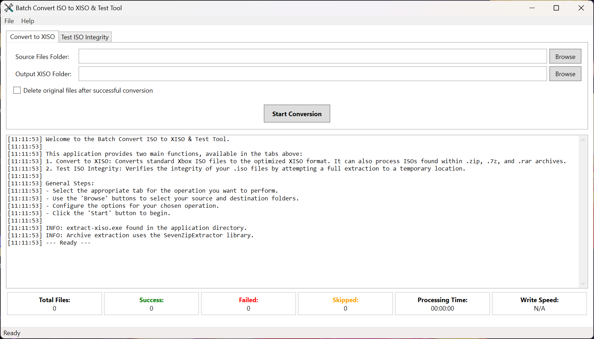

# Batch Convert ISO to XISO

A simple Windows WPF application for batch converting Xbox Original ISO files to the optimized XISO format using the `extract-xiso` command-line tool. It also supports extracting and converting ISO files contained within ZIP, 7Z, and RAR archives using `7z.exe`.

 <!-- Placeholder for a screenshot -->

## Overview

Batch Convert ISO to XISO is a Windows application that provides a user interface for converting multiple Xbox Original ISO files to the XISO format. It leverages the functionality of the `extract-xiso` command-line tool for the conversion process and integrates `7z.exe` to handle ISOs packaged within common archive formats (ZIP, 7Z, RAR), providing a streamlined batch processing experience.

## Features

*   **Batch Processing**: Convert multiple ISO files in a single operation.
*   **ISO/XISO Support**: Specifically designed for converting standard Xbox Original ISO images to the optimized XISO format. It can also process existing XISO files (which `extract-xiso -r` will typically skip if already optimized).
*   **Archive Support**: Automatically extracts ISO files from `.zip`, `.7z`, and `.rar` archives found in the input folder.
*   **7-Zip Integration**: Uses `7z.exe` for `.7z`, `.zip`, and `.rar` extraction. `7z.exe` and `7z.dll` (if required by your version) are included with the application release.
*   **Progress Tracking**: Provides a progress bar and real-time log messages detailing the status of each file being processed.
*   **Delete Original Option**: Option to delete the original source files after successful conversion. This includes standalone ISOs and original archive files if all contained ISOs were successfully processed. **Use with caution!**
*   **Global Error Reporting**: Includes a feature to automatically send silent bug reports to the developer with comprehensive error details (system info, error message, stack trace, and application log) to aid in improving the application.
*   **User-Friendly Interface**: Simple and intuitive Windows interface.

## Supported File Formats

*   **ISO files**: Standard Xbox Original ISO images.
*   **ZIP, 7Z, RAR archives**: Archives containing `.iso` files (extraction is recursive).

## Requirements

*   Windows 7 or later
*   [.NET 9.0 Runtime](https://dotnet.microsoft.com/download/dotnet/9.0)
*   `extract-xiso.exe`: The command-line tool for converting ISOs. This executable **must** be placed in the same directory as the application. [A common source for `extract-xiso` is the XboxDev GitHub repository](https://github.com/XboxDev/extract-xiso) (you will need to find a pre-compiled Windows binary).
*   `7z.exe` and optionally `7z.dll`: The command-line tool for archive extraction. These files are included with the application release and must be in the same directory as the application.

## Installation

1.  Download the latest release from the [Releases page](YOUR_RELEASES_PAGE_URL_HERE).
2.  Extract the contents of the downloaded zip file to a folder of your choice.
3.  Obtain `extract-xiso.exe` and place it in the same folder where you extracted the application files.
4.  Ensure `7z.exe` (and `7z.dll` if present in the release zip) are also in the same folder.
5.  Run `BatchConvertIsoToXiso.exe`.

## Usage

1.  **Select Input Folder**: Click the "Browse" button next to "Input Folder" and choose the folder containing your ISO files and/or archives (ZIP, 7Z, RAR).
2.  **Select Output Folder**: Click the "Browse" button next to "Output Folder" and choose where you want the converted XISO files to be saved.
3.  **Delete Original Files**: Check the "Delete original files after conversion" box if you want the original standalone ISOs or original archive files (if all contained ISOs processed successfully) to be automatically deleted. **Use with caution!**
4.  **Start Conversion**: Click the "Start Conversion" button.
5.  **Monitor Progress**: The log viewer will show the progress and status of each file. A progress bar will indicate the overall progress.
6.  **Cancel**: Click the "Cancel" button to stop the current batch process. The application will attempt to finish processing the currently active file before stopping.
7.  **Completion**: A summary message box will appear when the batch process is finished, showing how many files were converted, skipped (if already optimized), and failed.

## About XISO Format

XISO is the native disk image format used by the Original Xbox console. It is essentially an ISO 9660 image with specific padding and structure optimized for the Xbox hardware. Converting standard ISOs (often created from disc dumps) to XISO ensures they are in the correct format for use with modded Xbox consoles, emulators like Xemu, or other Xbox development tools. The `extract-xiso -r` command rebuilds the ISO to the correct XISO structure, often removing unnecessary padding and optimizing the file layout.

## Why Use XISO?

*   **Compatibility**: XISO is the standard format expected by modded Xbox consoles and emulators, ensuring games load correctly.
*   **Optimization**: `extract-xiso` can optimize the file structure and remove padding, potentially reducing file size compared to a raw ISO dump (though the primary benefit is format correctness, not always significant size reduction like CHD).
*   **Data Integrity**: Using `extract-xiso` helps verify the structure of the ISO and rebuild it correctly.

## Troubleshooting

*   Ensure `extract-xiso.exe` and `7z.exe` (and `7z.dll` if needed) are present in the same directory as the application.
*   Make sure you have appropriate read permissions for the input folder and write permissions for the output folder and temporary extraction folders.
*   If `.zip`, `.7z`, or `.rar` extraction is failing, verify that `7z.exe` is not missing or corrupted.
*   Review the application log window for detailed error messages during conversion or extraction.
*   Automatic error reports will be sent to the developer if unexpected issues occur.

## Acknowledgements

*   Uses **extract-xiso** for the core ISO to XISO conversion. [Find more information or source here (e.g., on GitHub)](https://github.com/XboxDev/extract-xiso).
*   Uses **7-Zip** (`7z.exe`) for extracting `.zip`, `.7z`, and `.rar` archives. [Official 7-Zip website](https://www.7-zip.org/).
*   Developed by [Pure Logic Code](https://www.purelogiccode.com).

---

Thank you for using **Batch Convert ISO to XISO**! For more information and support, visit [purelogiccode.com](https://www.purelogiccode.com).
